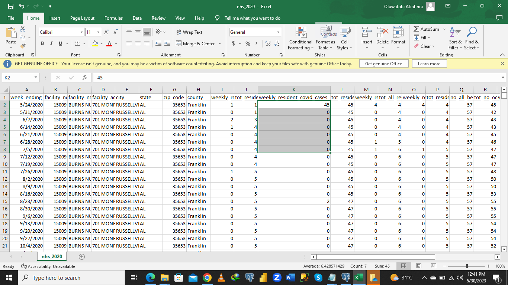
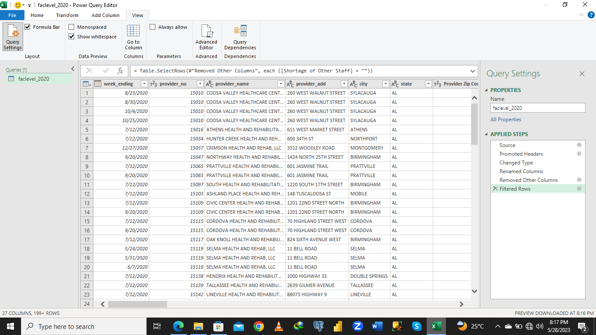
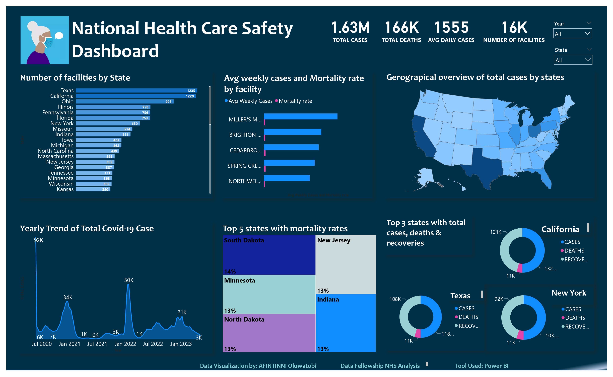

# Covid-19-NHSN-Analysis
COVID-19 National Healthcare Safety Network (NHSN) Data Analysis

## INTRODUCTION 
The CDC’s National Healthcare Safety Network is the United States most widely used healthcare-associated infection (HAI) tracking system. NHSN provides facilities, health departments, tracking system, states, regions, and the nation with data needed to identify problem areas, measure progress of prevention efforts, and ultimately eliminate healthcare-associated infections.
For this project, we focused our analysis on the impact of covid-19 on nursing home residents, facilities, and to derive insights from the NHSN dataset. 

## PROBLEM STATEMENT 
- Perform an Exploratory Data Analysis on the COVID-19 National Healthcare Safety Network (NHSN) dataset!
- Perform statistical analysis to understand the impact of COVID-19 on healthcare facilities.
- Generate meaningful visualizations and reports to present the findings to stakeholders.
- Identify potential areas for improvement in healthcare practices based on the analysis.

## Tools Used
To transform, analyze and provide insights, the following tools were used
- Microsoft Excel
- Power Query
- SQL
- Power BI

## Skills Demonstrated
- Data Manipulation
- Functions used to Query (Aggregate functions, UNION Set Operations, Common Table Expressions, Correlations, Joins, Case Statements)
- DAX
- Quick Measures
- Filters use in Power BI
- Slicers in Power Bi

## DATA EXPLORATION & CLEANING
I explored the four datasets with excel, where I noted data quality issues needed for cleaning and transformation. The links to the datasets are seen here- 
- [2020](https://download.cms.gov/covid_nhsn/faclevel_2020.zip)
- [2021](https://download.cms.gov/covid_nhsn/faclevel_2021.zip)
- [2022](https://download.cms.gov/covid_nhsn/faclevel_2022.zip)
- [2023](https://download.cms.gov/covid_nhsn/faclevel_2023.zip)

For 2020, the original dataset contained 491,095 rows and 137 columns. The following steps breaks down the cleaning process I took in ensuring the dataset was clean, valid and ready for analysis.
- Dropped Irrelevant columns 
- Converted Facility no to text Datatype
- 4837 NULL records WERE dropped
- Filled missing values with 'N/A' for string/text variables
After cleaning, 486,258 rows and 27 columns remained.

For 2021, the original dataset contained 793,610 rows and 137 columns.. The following steps breaks down the cleaning process I took in ensuring the dataset was clean, valid and ready for analysis.
- Dropped Irrelevant columns 
- Converted Facility no to text datatype 
- 5222 NULL records WERE dropped
- Filled missing values with 'N/A' for string/text variables
After cleaning, 788,388 rows and 27 columns remained.

For 2022, the original dataset contained 786,883 rows and 137 columns... The following steps breaks down the cleaning process I took in ensuring the dataset was clean, valid and ready for analysis.
- Dropped Irrelevant columns 
- Converted Facility no to text datatype 
- 4748 of NULL records WERE dropped
- Filled missing values with 'N/A' for string/text variables
After cleaning, 782,134 rows and 27 columns remained.

For 2023, the original dataset contained 285,742 rows and 137 columns... The following steps breaks down the cleaning process I took in ensuring the dataset was clean, valid and ready for analysis.
- Dropped Irrelevant columns 
- Converted Facility no to text datatype 
- 1174  of NULL records WERE dropped
- Filled missing values with 'N/A' for string/text variables
After cleaning, 285,028 rows and 27 columns remained.

Cleaning_1              |           Cleaning_2
:------------------------:|:---------------------:
     |

## DATA ANALYSIS
For this phase, I created the NHS Database in postgreSQL, to accomodate the cleaned dataset and imported the 4 tables into the NHS. After importing the tables, I further explored the datasets, to ask questions that were used to answr questions and  provide Insights. The project questions were 

1. Which healthcare facilities had the highest average number of daily COVID-19 cases in
2021? Display the top 10 facilities.
2. Calculate the 7-day moving average of new COVID-19 cases for each healthcare facility.
Which facility had the highest peak in the moving average?
3. Determine the total number of COVID-19 cases, deaths, and recoveries for each state.
Include the state's name and the corresponding counts in the result.
4. Find the top 5 states with the highest mortality rate (deaths per COVID-19 case) in 2022.
5. Identify the healthcare facilities that experienced a significant increase in COVID-19
cases from 2020 to 2021 (more than 50% increase). Display the facility names and the
percentage increase.
6. What is the total number of COVID-19 cases, deaths, and recoveries recorded in the
dataset?
7. Find the healthcare facilities that had a consistent increase in COVID-19 cases for at
least 5 consecutive months. Display the facility names and the corresponding months.
8. Calculate the mortality rate (deaths per COVID-19 case) for each healthcare facility.
9. Are there any significant differences in COVID-19 outcomes based on the type of
healthcare facility (e.g., hospital, nursing home)?
10. How has the number of COVID-19 cases evolved over time (monthly or quarterly)?
11. What is the distribution of healthcare facilities by state?
12. Find the healthcare facilities with the highest occupancy rates for COVID-19 patients.

The solutions to these questions can be found [here](https://github.com/TobyDavids/Covid-19-NHSN-Analysis/edit/main/Covid-19-NHSN-Analysis.md)

## DATA VISUALIZATION
The dashboard contains 1 page of report. It was created to provide insights and answer the questions posed during the analysis phase. 
You can interact with the dashboard [here](https://app.powerbi.com/groups/me/reports/05f48389-54f2-44ce-8eaf-2cfae370c163/ReportSection?experience=power-bi). 

## INSIGHTS
1. Between May, 2020 and May 2023, there were 1,632,695 recorded covid cases by the NHSN for nuring home residents. 
2. The total number of available facilities to handle these cases amounted to 16,000
3. From the 1.6m covid cases, a total of 166,244 deaths were recorded accounting for a 10% of the total cases. Recovered cases amounted to 1,466,451 accounting for 90% of cases
4. Miller's Merry Manor, Brighton Rehabilitation and wellness centre, and cedarbrook senior care and rehabilitation centre recorded the top 3 average weekly cases amongnst all facilities, with 6.9, 5.4, and 5.1 average weekly cases respectively. 
5. The high average weekly cases recorded by Brighton Rehabilitation and wellness centre, and cedarbrook senior care and rehabilitation centre both are from the state of pensylvania, which is one of the most populous states in the United states. Population density in this state is clearly a factor in the high average weekly cases recorded in these facilities. Miller's Merry Manor on the other hand is a facility in Indiana which is the 17th mots populous state. Other factors like the demography of resients must have contributed to the high average weekly cases. 
6. Texas, California, and Newyork recorded the highest cases across all states overtime 🤒. This is expected as they are one of the most densely populated states in the US. Dense population within these states is a major factor that contributed to high recorded covid-19 cases. Newyork, and California are also home to major international airports and are popular destinations for both domestic and international travelers.
7. The 5 states that recorded the highest mortality rates were South Dakota with 14%, Minnesota, North Dakota, New Jersey and Indiana with similar rates of 13%. :sad:
8. Overtime, there has been inconsistent levels of cases between mid 2020 and May 2023. There were a few outliers, most prominent being Jan 2022 with a sharp increase. In the first & 2nd week in 2022, more than 49,000 covid cases of nursing home residents were recorded, the highest weekly caseload since the start of the pandemic. Cases increased by over 700% from December 2021. 
9. There is a strong positive correlation between Total Cases and Total Recoveries, indicating that an increase in cases, contributed to increased recovery, implying that the nursing homes had resources to handle and curb covid-19 cases through massive efficient vaccinations.
10. January' accounts for the majority of tot_cases for quarter 1 overtime, while May accounts for the majority of tot_cases for quarter 2 overtime. 

## RECOMMENDATIONS
1. There is a need to increase the number of NHSN facilties and equip them with all resources to ensure cases are handled with speed and efficiency. 
2. More NHS nursing staffs are needed to be hired to handle numerous cases.
3. For states like Texas, Newyork and California, there is a need to provide them with more resources compared to other states. 
4. There is a need to intensify the introduction of innovation into health care to be able to detect cases faster, and handle these cases with precision and efficiency to reduce mortalitye rates to the bearest minimum
5. THE NHSN should focus and prepare for residents and other patients cases when periods are approaching winter, most especially from December to Februrary, with January as a red alert month. 
6. The NHSN should treat these states (South Dakota , Minnesota, North Dakota, New Jersey and Indiana ) with high importance as they recorded the highest mortality rates. By providing more education, monitoring & Evaluation excercises to residents and patients from these states, potential case spread can be reduced and prevented. 
7. Facilities like  Miller's Merry Manor, Brighton Rehabilitation and wellness centre, and cedarbrook senior care & rehabilitation centre needs to be really monitored and evaluated for faster solutions in preventing increase in average weekly cases. 
8. Overall, the best health practices and prevention methods, through education, innovation, Data wrangling and analysis are highly important and need to be maintained and made a priority for health care workers, nurses, doctors, patients and the general public. 
9. Only consistent education at every level can help curb cases and other potential transmitable diseases. 

Thank you for sticking with me 😃
## REFERENCES
1. https://www.cdc.gov/nhsn/index.html
2. https://data.cms.gov/ 
